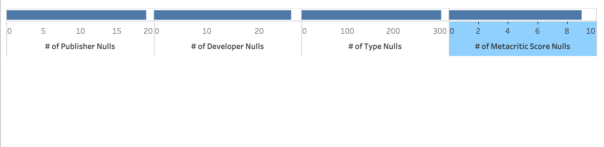
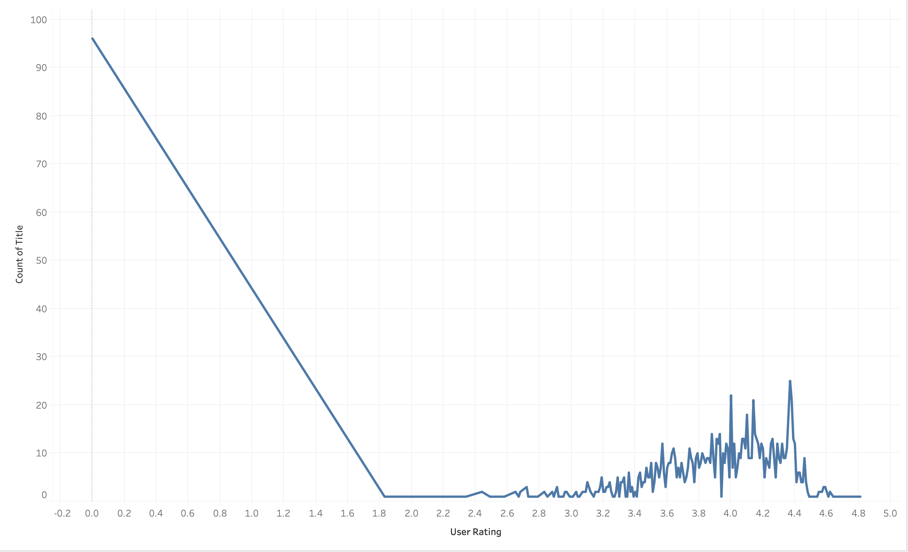
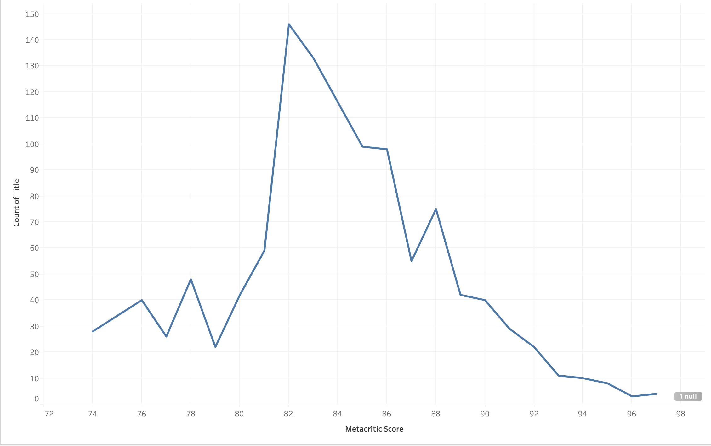
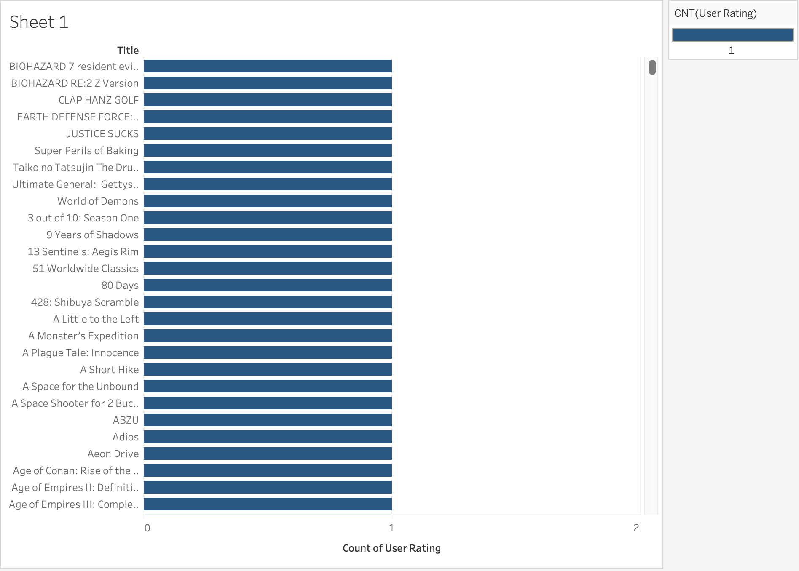
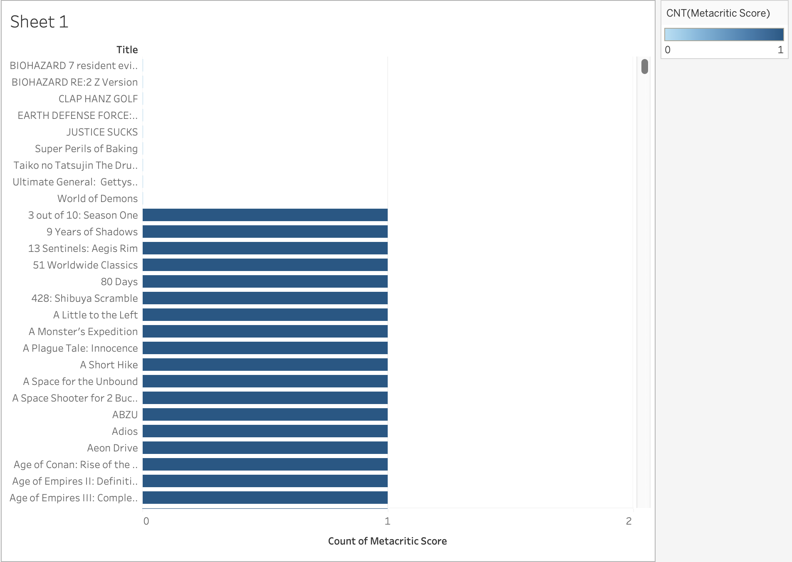
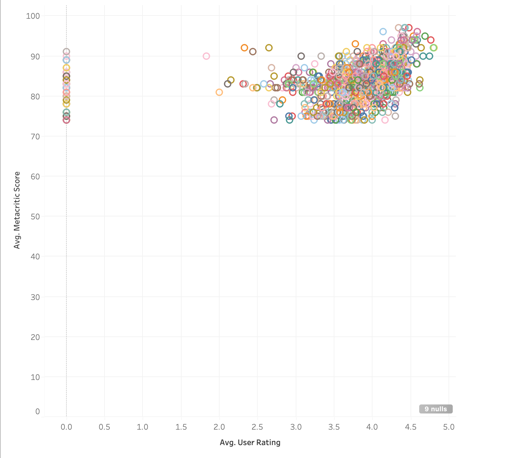

# EDA Summary of Game Statistics
### By: Adam Cisneros

## Dataset Source
After looking through public datasets, I found that the majority of them were at least 5 years out of date. This was true at least for the type of data I was looking for for games. So, to ensure recency, I am using the RAWG API (Docs Here: https://rawg.io/apidocs) so that I can query games that are recent and well-known today. This provides me with more accurate classification metrics for today's mood and time. In other words, how critics score certain games has changed over the years and can change in just one so this recency ensures a better accuracy for classifying and predicting on future, unseen games. In order to visualize the data, I made API requests for a spread of 5-year time frame which queried a sample of 400 games each for a total of 1200 games to do an EDA of. I then put these 1200 games into one big csv and used Tableau to analyze and plot the data. The data has relevant columns that include: title, genres, type (Singleplayer, Multiplayer, etc.), developer, publisher, user_rating, and metacritic_score. (My CSV data source can be found in the rawg_games.csv file)

## EDA
### Nulls
To start the EDA, the first thought that came to mind was, How many Nulls or N/As are present in each data column? To do this I ran a count of Nulls in each column and kept only those with greater than one Null. The counts and plots can be seen below:

With this visualization, it can be seen that, out of the 1200 games, there are not very many Null values. This is true aside from the Type category which tells us whether a game is Singleplayer, Multiplayer, etc. which means that this may not be a good category to use for in my features for my classification model unless I find correct data to parse onto it or just get rid of these games altogether at the risk of losing those learning opportunities in my model. Overall, there are very few Null values in this data set and it seems to be very usable in that regard.

### Rating Distributions
Next, I wanted to look into the distribution and values for the user ratings. I started by first plotting amount of games vs. user rating and got the plot below:

Here we see that the distribution is skewed right and multimodal which was expected. I had suspected that this would be multimodal with the modes being on each end. People tend to leave reviews if they feel strongly about a game and that is why we see most reviews at the extreme ends of the distribution. What I did not expect was the fact that there are far more bad reviews than good reviews for games which made the distribution skewed right.

I then did the same for Metacritic reviews and got the below plot:

Here we see a much different story where the ratings, if there is one, do not fall below ~74 and they remain a relatively normal distribution. With the user reviews being skewed and multimodal, these reviews are quite high and more normal than the user reviews. This tells me that either Metacritic does not typically review or take the effort to leave reviews on bad games or they are paid or incentivized (paid, received game for free, etc.) to play a game and review it which could lead to potential bias.

### Rating Values/Attributes
Next I wanted to see just how many reviews per game there were in this dataset. So, I started with User reviews and after plotting the data in Tableau, I got the below visualization:

It was very interesting to me that there was only one review per game for every game as the only bin for the amount of reviews was 1. This does not give my data a lot of variety or viewpoint for a review of a game which could affect the overall accuracy of my classifier. It could also be that the API already averaged the ratings and just had one entry for that average rating calculation.

I saw a similar distribution for Metacritic reviews below:

Here we see the same thing happening with the user reviews where there is only Metacritic review per game if it has one. The only difference between the two is that there are a select few games with no review in terms of Metacritic score. The reasoning for this follows the same reasoning for why the user reviews was this way.

### Rating Correlation

Finally, I wanted to see if there was any correlation between user reviews and the critic reviews so I made the plot below:

Here we see that there is in fact no correlation between critic score and user review. In a perfect world there would be a correlation with a positive linear line where critics and users tell the truth and are correct. However, there are reasons for bias due to outside forces that cause this discrepancy in the data. This leads me to believe that since there does not seem to be a correlation, that making this classification model will really help to see what is favored in the critic's eyes versus the user's eyes so that the truth is uncovered.

## What Was Learned
Throughout this data analysis I learned a lot about how my data was distributed and how "clean" it was. I found there to be little to no Null values in my columns and found interesting distributions in certain areas as well. I also learned that with there being no correlation between user and critic reviews that there are discrepancies between user and critic reviews which makes this model quite useful in determining the true value of a game, whether critics just favor it or it really is a great game. One thing I did take away from this experience is that I may have to get rid of my "Type" feature and replace it with another useful feature as the Null values in that column involve ~25% of the games.

## Remaining Issues/Open Questions
An issue that remains is that I have a column with ~25% Null values. I will most likely replace this feature with another feature I can find with very little to no Null values. However, the question still remains, How useful really are these features I picked from the API to use in my dataset? The only way to know for sure is to put it in a model and evaluate it.