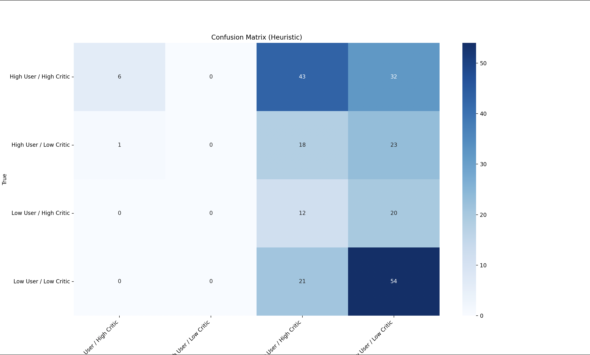
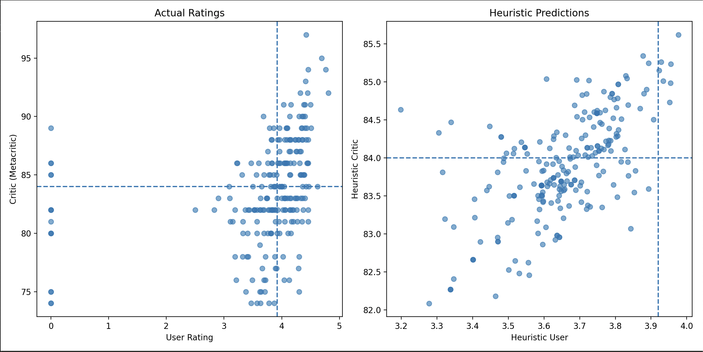
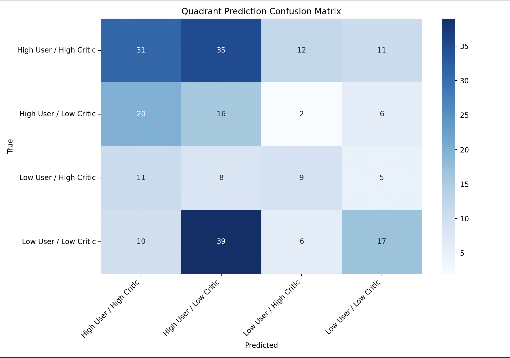
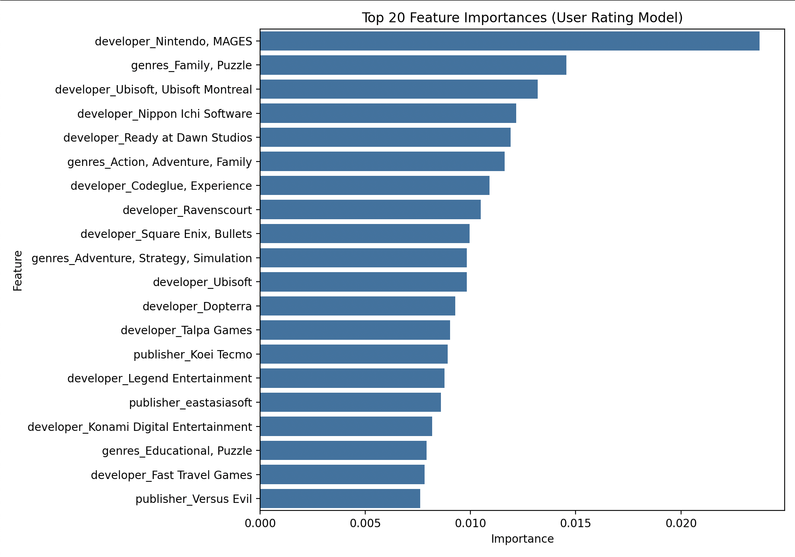
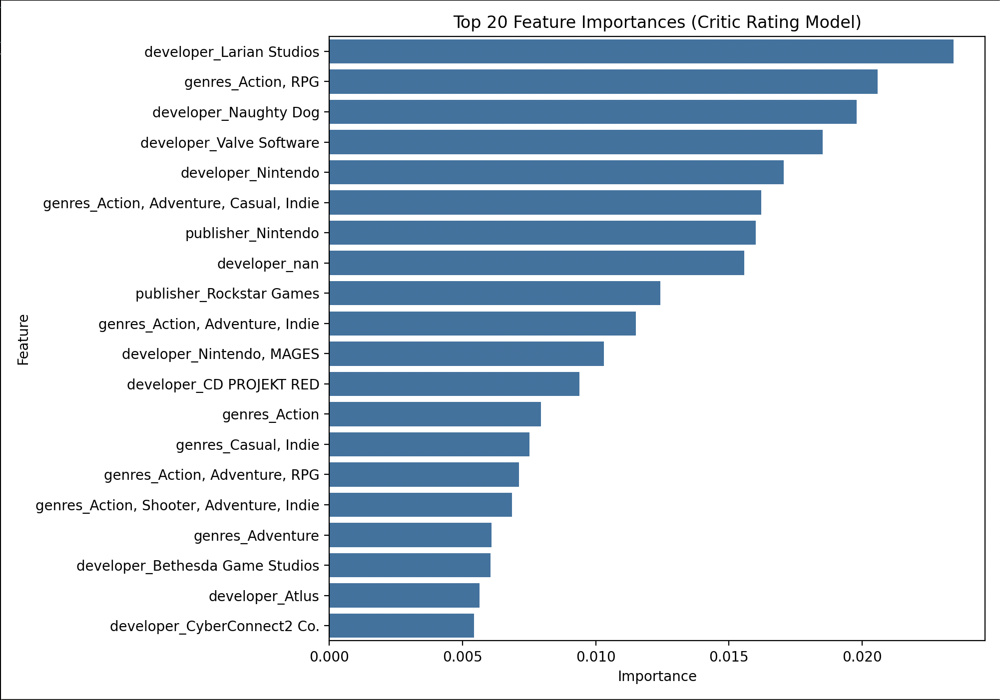
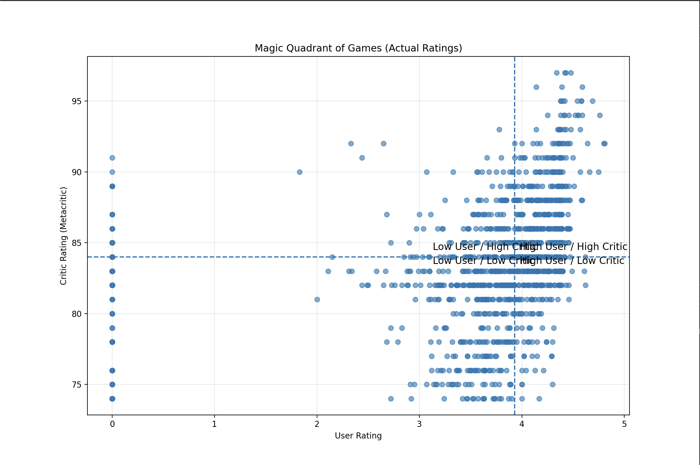
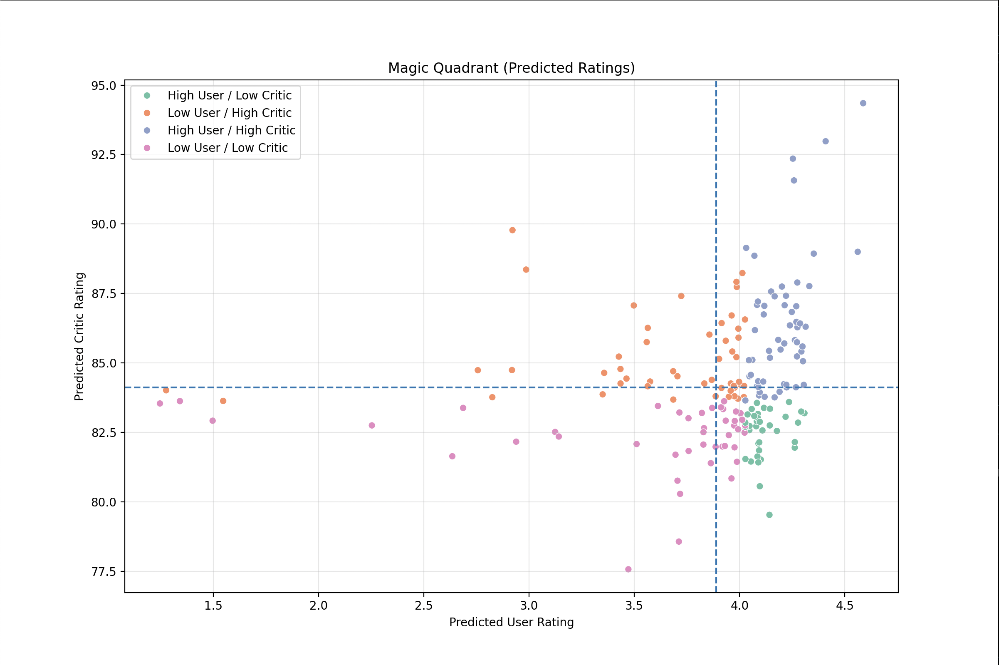
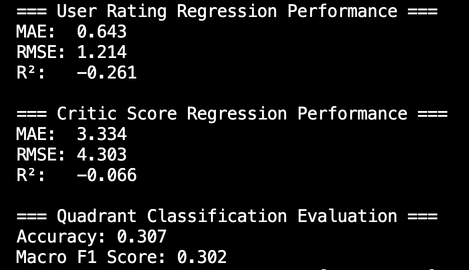

# First Draft Report
### By: Adam Cisneros

## Models
### Global Heuristic
I began with a simple global heuristic. I used weighted features of publisher, developer, and genre categories. For each of these features, the model computes blended means of critic and user scores, then combines the means into a single heuristic metric.

Quadrant boundaries were determined using the median critic and user scores from the training data. If a game’s heuristic-based score exceeded the median for either dimension, it was labeled "good" in that dimension; otherwise, it was labeled "bad." Finally, the model plots the quadrant lines along with critic score vs. user score to visualize results.

#### Evaluation (Global)
To evaluate this model, I used a confusion matrix to visualize classification performance:

The model primarily predicts in the low-user/low-critic quadrant, indicating a strong bias toward negative classifications. The actual and predicted labels disagree frequently, suggesting the model is not highly accurate.

Next, I plotted the actual scores with their quadrant assignments and compared them to the predicted quadrant assignments:

Several differences stand out: the model predicts fewer high user and critic scores compared to the actual data, and predicted user scores show a wider spread. These observations are consistent with the confusion matrix, where lower ratings were over‑predicted.

Finally, using sklearn’s accuracy and F1 metrics, I obtained the following performance summary:

The accuracy is low (~31.3%), but with improved features and weights, this heuristic could be strengthened.

### Random Forest Classifier
This classifier uses the same base features as the global heuristic, but incorporates feature‑engineering pipelines and separate regression models for predicting user and critic ratings. Quadrant boundaries are again derived from median critic/user scores in the training set, and predictions are labeled accordingly.

#### Evaluation (RFClassifier)
I first evaluated the classification results using a confusion matrix:

Compared to the global heuristic, the Random Forest model predicts more positive cases and shows a more balanced spread across all quadrants. The diagonals appear darker, indicating more correct predictions.

Below are the feature importance plots for both user and critic predictions:

In both cases, developer-related features carry the most predictive signal, which is pretty intuitive as well‑known, reputable developers tend to produce consistently strong games.

To visualize the final predictions, I plotted actual vs. predicted quadrant placements:

Predicted user scores tend to be slightly higher than the actual distribution, but overall the spread is reasonably close to real data.

Finally, I calculated the overall accuracy by comparing predicted quadrant labels to ground truth labels:

The accuracy is similar to the global heuristic model. This may indicate that my feature set is insufficiently informative or that a different model type would be more appropriate.

## Conclusion/Future Improvements
Overall, these models provide a solid starting point. The global heuristic depends heavily on historical performance of studios and publishers, which causes it to fail when data is sparse (e.g., new or low‑output developers). The Random Forest classifier performs better when more data is available but is still limited by the quality of the input features.

I believe the main issue lies in the features I’m using. I plan to engineer better features that capture more relevant characteristics of the games. Increasing dataset size will also help both models generalize better. I will additionally explore more advanced or robust models.

Although ~30% accuracy is not ideal, it serves as a baseline that I intend to improve significantly. With better features, more data, and model experimentation, I expect substantial performance gains in future iterations.